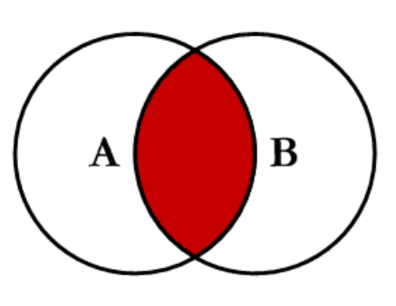
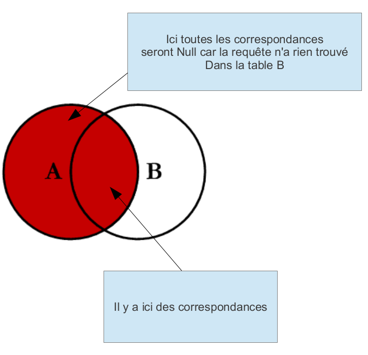
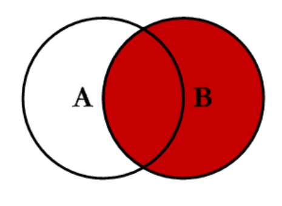
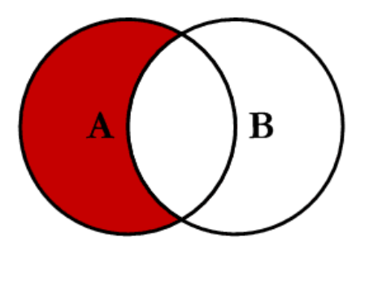

# Jointure

## Introduction

Les jointures permettent d'extraire des données de plusieurs tables, dans le modèle relationnel SQL on décompose en tables (entités) les données, il est donc nécessaire de faire des jointures pour extraire des données se trouvant dans différentes tables.

## Principe

Une jointure met en relation deux tables sur la base d'une clause de jointure (comparaison de colonne). Généralement, cette comparaison fait intervenir une clé étrangère d'une table avec une clé primaire d'une autre table. FK=PK, ils sont en particulier des indexes donc la requête s'effectue plus vite...

## Le jointures interne (INNER JOIN )

Equijointure  dans la clause de jointure on utilise "="
Auto-jointure une équijointure sur la même table (on doit utiliser des alias pour distinguer les deux mêmes tables)

Dans une jointure interne seules les correspondances entre les deux tables sont extraites, on perd donc les données n'ayant pas de correspondances!

```sql
SELECT t1.title, t2.title
FROM A as t1
INNER JOIN B as t2
ON t1.k=t2.k;
```




## La jointure externe (LEFT OUTER JOIN  ou RIGHT OUTER JOIN)

Elle favorise une table dite dominante par rapport à une table dite dominée, lorsqu'il n'y a pas de correspondance dans le prédicat de jointure les données apparaissent dans la pseudo-table.

Lorsqu'on extrait les données dans une jointure externe ce sont les données de la table dominante qui sortent avec des correspondances NULL si aucune correspondance n'est trouvée dans la table dominée.

Attention pas de FULL OUTER dans MySQL qui permet d'ignorer l'ordre entre les tables (subordonnée et dominante).





Jointure droite



## Autres types de jointures

```sql
-- on exclue l'intersection
SELECT t1.title, t2.title
FROM A as t1
LEFT OUTER JOIN B as t2
ON t1.k=t2.k
WHERE t2.k IS NULL
```



Notez que l'on peut également exclure A uniquement.


### Jointure Naturelle
Fait automatiquement la liaison sur le champs ayant le même nom dans les 2 tables.

```sql
SELECT t1.title, t2.title
FROM A as t1
NATURAL JOIN B as t2;
```

