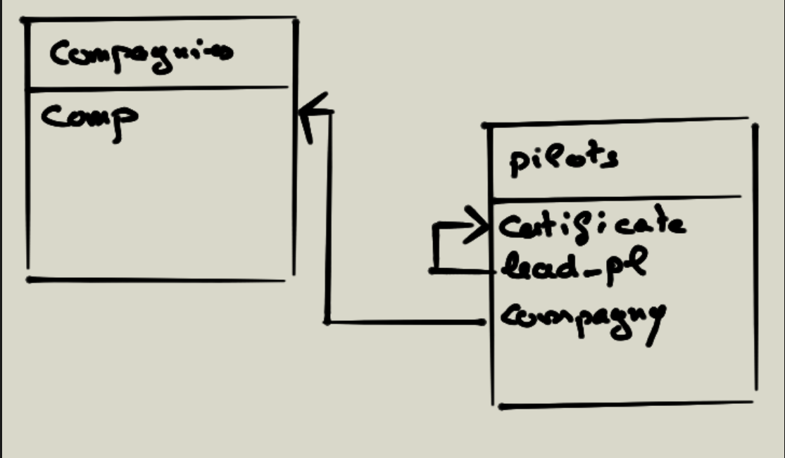

# Jointures exercices

## 01 Exercice ajouter une clé étrangère

Ajoutez la clé étrangère "lead_pl" dans la table pilots. Cette clé étrangère se référencera à la clé primaire de la même table.

```sql
ALTER TABLE `pilots` 
ADD COLUMN `lead_pl` VARCHAR(6) AFTER `certificate`,
ADD CONSTRAINT `fk_pilots_lead` 
    FOREIGN KEY (`lead_pl`) 
    REFERENCES `pilots` (`certificate`);
```




Mettez à jour la table pilots sachant que Pierre est le chef pilote de Alan, Tom et Yi. Et que Jhon est le chef pilote de Sophie, Albert et Yam.

```sql
UPDATE pilots 
SET lead_pl = 'ct-7'
WHERE name IN ('alan', 'Tom', 'Yi');

UPDATE pilots 
SET lead_pl = 'ct-6'
WHERE name IN ('Albert', 'Sophie', 'Yan');

-- Ou bien :
UPDATE `pilots` 
SET `lead_pl` = (
    CASE 
        WHEN name IN ('alan', 'Tom', 'Yi') THEN 'ct-7'
        WHEN name IN ('Albert', 'Sophie', 'Yan') THEN 'ct-6'
        ELSE NULL
    END);

-- Ou bien :
UPDATE `pilots` as p
SET `lead_pl` = (
    CASE 
        WHEN p.name IN ('alan', 'Tom', 'Yi') THEN (
            SELECT certificate FROM (
                SELECT p2.certificate 
                FROM pilots as p2 
                WHERE p2.name = 'Pierre'
            ) as p22
        )
        WHEN p.name IN ('Albert', 'Sophie', 'Yan') THEN (
            SELECT certificate FROM (
                SELECT p3.certificate 
                FROM pilots as p3 
                WHERE p3.name = 'Jhon'
            ) as p33
        )
        ELSE NULL
    END);
```
Afficher la moyenne des heures de vol pour les compagnies qui sont en France, AVEC UNE JOINTURE.

```SQL
-- Moyenne demandée
SELECT AVG(numFlying)
FROM pilots
JOIN compagnies as c ON comp = compagny
WHERE c.city = 'France'
GROUP BY compagny;

-- exemple avec un LEFT JOIN  (pas d edifférence ici)
SELECT AVG(numFlying)
FROM pilots
LEFT JOIN compagnies as c ON comp = compagny
WHERE c.city = 'France'
GROUP BY compagny;

-- Exemple avec un RIGHT JOIN => permet d'avoir un résultat supplmentaire, celuide Air Electric
SELECT AVG(numFlying)
FROM pilots
RIGHT JOIN compagnies as c ON comp = compagny
WHERE c.city = 'France'
GROUP BY compagny;

-- On récupère en plus le nom de chaque compagnie
SELECT c.name, AVG(numFlying)
FROM pilots
RIGHT JOIN compagnies as c ON comp = compagny
WHERE c.city = 'France'
GROUP BY compagny, c.name;
```


Ecrire et exécuter une requête pour déterminer les pilotes qui n'ont pas de chef. Afficher aussi le nom de leur compagnie.

```sql
SELECT p.name as pilotName, c.name as compagnyName
FROM pilots p 
JOIN compagnies c ON p.compagny = c.comp 
WHERE lead_pl IS NULL;
```


*Jointures internes.*

## 02 Exercice Jointures

- Sélectionnez les certificats des pilotes et les noms des compagnies pour lesquelles ils travaillent.

- Sélectionnez les certificats et les noms des pilotes travaillant pour la compagnie 'Air France', et ayant fait plus de 60 heures de vol.

## 03 Exercice sommes des heures de vol

Faites la somme des heures de vols de tous les pilotes de la compagnie AUSTRA Air (recherche par rapport au nom de la compagnie dans la table compagnies).

## 04 Exercice sommes des heures par compagnie

Faites maintenant la somme des nombres des heures de vol par compagnie en donnant le nom des compagnies.

## Jointures externes (rappel)

Rappelons qu'une jointure externe permet d'extraire des enregistrements qui ne répondent pas aux critères de jointure. Lorsque deux tables sont en jointures externes, une des deux tables est dite dominante (subordonné) par rapport à l'autre.

**Retenez que ce sont les enregistrements de la table dominante qui sont retournés et cela même s'ils ne satisfont pas aux conditions de jointures.**

## 05 Exercice pilotes et compagnies & insertion d'information dans la table pilots

- Sélectionnez le nom de la compagnie, le certificat du pilote et le nom du pilote même si la compagnie n'emploie pas de pilote.

Insérez maintenant le pilote suivant, il ne sera pas rattaché à une compagnie.

- Nom : Harry, certificat ct-19. Il n'a aucun leader pilot a fait 0 heure de vol, n'est rattaché à aucune compagnie, a un bonus de 100, a fait 0 jour de travail n'a aucun vol planifié et a pour date de naissance : '2000-01-01 12:00:00'.

- Sélectionnez le nom de la compagnie, le certificat du pilote et le nom du pilote, même si le pilote n'est pas rattaché à une compagnie.

Nous allons maintenant présenter une dernière jointure : la jointure bilatérale. Dans ce cas aucune des deux tables ne jouent le rôle de table dominante.

## 06 Exercice bilatéral FULL OUTER JOIN

Sélectionnez les compagnies et leurs pilotes incluant les compagnies n'ayant pas de pilote et les pilotes n'ayant pas de compagnie.

Indication : utilisez la clause UNION pour faire la requête FULL OUTER JOIN. **Notez qu'avec la clause UNION les enregistrements identiques ne seront pas répétés dans les résultats.**

Une autre question possible c'est d'afficher que les compagnies qui n'ont pas de pilote et les pilotes qui n'ont pas compaginie.
