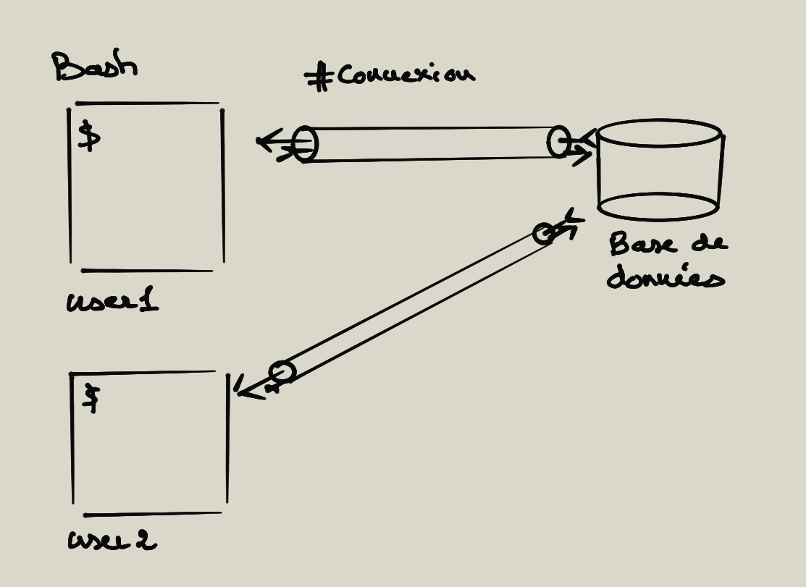

# SQL : Structured Query Language

## Introduction

Développé initialement par IBM, créé en 1974 et normalisé en 1987.

Le SQL est un langage normalisé servant à exploiter des bases de données relationnelles (stockage de l'information/données décomposées et organisées dans des objets de type tables).

Un système de gestion de base de données, **SGDB**, est un **logiciel** qui implémente le paradigme ou norme SQL. Ils sont des intermédiaires entre l'utilisateur et la base de données permettant l'enregistrement, l'extraction, la mise à jour ou la supression des données.

Les données sont enregistrées dans les tables de la base de données.

*Remarque : le NoSQL est un autre paradigme pour la gestion des données, il est basé sur le SQL, Not Only SQL.*


## Groupes de commandes du SQL

On distingue 4 groupes de commandes :

- DDL data definition language
CREATE, ALTER, DROP, RENAME

*Ce groupe permet la création, la modification, le renommage ou la suppression des tables d'une base de données.*

- DQL data query language
SELECT

*Cette commande permet l'extraction des données.*

- DML data manipulation language
INSERT, DELETE, UPDATE

*Ces commandes permettent l'insertion, la suppression ou la mise à jour des enregistrements.*

- DCL data control language
GRANT, REVOQUE, COMMIT, ROLLBACK

*Ce groupe permet d'administrer les droits des utilisateurs des bases de données et de mettre en place le modèle transactionnel.*

## MySQL SGDB

MySQL est un serveur de base de données. Les bases de données contiennent des structures de données appelées des tables ou objets.

MySQL est sous la licence GPL, propriétaire détenue par ORACLE.

### Avatanges

- Multiplateforme

- Performance élevées en restitution (lecture DQL).

### Inconvénient

- Il est relativement peu réputé pour les bases de données à gros volumes.

\newpage

Un serveur de base de données contient donc plusieurs base de données. Ces bases de données contiennent des tables.


\newpage

Sur un serveur de base de données vous avez des accès privilégiés, avec des droits spécifiques sur une base ou plusieurs base de données.



\newpage

Nous utiliserons **MySQL** en créant des bases de données en **UTF8** ou **utf8mb4** avec la collation **utf8_general_ci**  ou utf8mb4_unicode_ci (ordre des caractères dans un jeu de caractères données ici l'UTF8). L'encodage utf8mb4 est un encodage étendu. Il permet d'encoder plus de caractères par rapport à l'UTF8.

Notons également que l'encodage **utf8_general_ci** est insensible à la casse, donc plus rapide dans toutes les recherches sur les données. CI = CASSE INSENSIBLE.

## Structure de données

Une base de données est constituée de tables. Elles sont constituées de colonnes/valeurs. Chaque colonne a son propre type **prédéfinie** de données.

```text
+----+---------------------+---------------+
| id | name                | department    |
+----+---------------------+---------------+
|  1 | Cousin              | Haute-Garonne |
|  2 | Sauvage-sur-Meunier | Guadeloupe    |
|  3 | Guerin              | Mayenne       |
|  4 | Jacquet             | Val-de-Marne  |
+----+---------------------+---------------+
```

Le type **id** est par exemple **integer**, **name** et **department** type VARCHAR, un type spécifique de caractères.

## Jeu de caractères

Un jeu de caractères est un ensemble de lettres, signes de ponctuations et autres symboles auxquels on associe un chiffre pour le définir : encodage des caractères.

**Unicode**, standard informatique sur l'échange des textes, a pour objectif de fournir un jeu de caractères **unique** pour représenter toutes les langues. L'UTF8 est un codage de caractères conçu pour coder l'ensemble des caractères internationaux d'Unicode; il reste compatible avec la norme ASCII ( American Standard Code for Information Interchange ).

L'UTF8 utilise un maximum de 4 octets par caractère. Par exemple, le "é" en UTF8 est codé sur deux octets : 11000011 10101001.

De par sa nature, UTF-8 est d'un usage de plus en plus courant sur l'Internet, et dans les systèmes devant échanger de l'information. Il s'agit également du standard Unicode le plus utilisé dans les écosystèmes GNU, Linux et compatibles, donc très utilisé pour les applications Web.

### Collation (rassemblement et comparaison)

En plus du "jeu de caractères" MySQL permet de choisir comment seront classées (ORDER BY) les données : c'est ce que l'on appelle la collation (COLLATE).

Comment ordonner A,a, B,b , ordre des accents, ...

Supposons que nous ayons un jeu de caractères de 4 lettres : A,B,a,b avec l'ordre suivant A=0, B=1, a=2, c=3, si maintenant on veut comparer les lettres A et B il suffit de comparer le nombre 0 et 1 et donc A < B. Ce que nous faisons ici correspond à une collation binaire. Cependant, le problème devient un peu plus complexe si on doit comparer A et a, il faut si la collation est sensible à la casse définir d'autres règles (regrouper a,b et A et B). Dans la réalité, une collation possède de nombreuses règles pour comparer les lettres.

Dans notre cas on utilisera la collation **utf8_general_ci** ou **utf8mb4_unicode_ci**, elle est insensible à la casse, ce qui permet de faire des recherches dans les tables plus rapidement.

MySQL peut être également configurée avec d'autres jeux de caractères.

Voici une commande permettant de connnaitre l'encodage des caractères dans une table posts sur une colonne "title", nous verrons plus loin dans le cours comment l'utiliser:

```sql
SELECT HEX(title) FROM posts;
```
