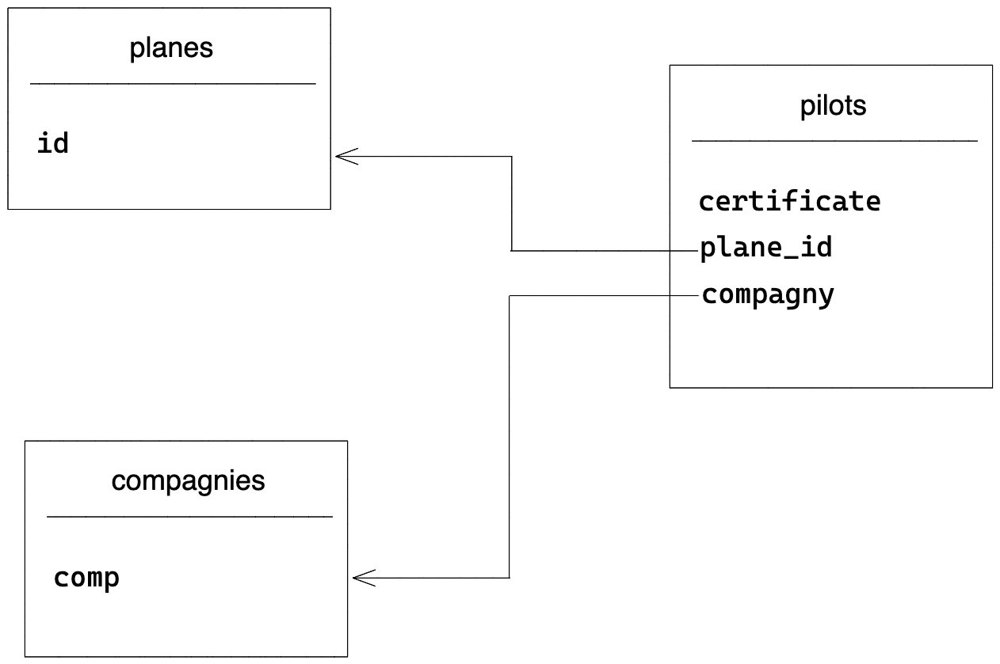

# Exercices SQL (à rendre le 16/04)

Vous pouvez vous mettre par équipe de 3 au plus. Vous devez me rendre l'ensemble du projet dans un fichier `examen.sql` sur Discord par groupe et de manière individuel.

## Sommaire

1. [Refactorisation du modèle de données](#refactorisation-du-modèle-de-données)
2. [Rappels sur les contraintes référentielles](#rappels-sur-les-contraintes-référentielles)
3. [Relation N:N](#relation-nn)
4. [Exercices](#exercices)

## Refactorisation du modèle de données

Nous allons créer un autre modèle de données dans la base de données `db_aviation`. _Faites une sauvegarde de l'ancienne base de données._

La relation que nous allons mettre en place est la même que celle que nous avons vu entre les tables `pilots` et `compagnies`. C'est une relation `1:N`.

- Un pilote est associé à maximum un unique avion de 0 à 1.
- Un avion peut avoir de 0 à N pilotes.

Nous allons voir les clés auto-incrémentées. Elles sont très pratiques. Nous n'avons pas à nous en soucier, car elles sont automatiquement mises à jour par MySQL lors de l'insertion (nouvel enregistrement dans la table). Lors de la suppression d'un enregistrement l'index de la valeur des clés est mémorisé. Les prochains enregistrements partiront du dernier index connu par MySQL. Notez également que les index numériques partent de la valeur entière 1.

Considérez le schéma suivant :




Créez la table `planes` avec les colonnes suivantes :

- id PK de type INT UNSIGNED AUTO INCREMENT
- name CHAR(5)
- description type TEXT
- numFlying type DECIMAL(8,1)

Vous insérerez les données suivantes dans la table `planes` :

```text
+----+------+--------------------------------+-----------+
| id | name | description                    | numFlying |
+----+------+--------------------------------+-----------+
|  1 | A380 | Gros porteur                   |   12000.0 |
|  2 | A320 | Avion de ligne quadriréacteur  |   17000.0 |
|  3 | A340 | moyen courrier                 |   50000.0 |
+----+------+--------------------------------+-----------+
```

Créez maintenant la clé étrangère `plane_id` dans la table `pilots`. Cette clé est exactement du même type que la clé primaire de la table `planes`.

```sql
ALTER TABLE `pilots`
ADD CONSTRAINT `fk_pilots_planes`
FOREIGN KEY (`plane_id`) REFERENCES `planes`(`id`);
```

Insérez et mettez à jour les tables `planes` et `pilots`, voyez les sources ci-dessous :

```sql
INSERT INTO `planes`
 (`name`, `description`, `numFlying`)
VALUES
('A320', 'Avion de ligne quadriréacteur', 17000.0),
('A340', 'Moyen courier', 50000.0),
('A380', 'Gros porteur', 12000.0);

UPDATE `pilots`
SET `plane_id` = 1
WHERE `plane` = 'A320';

UPDATE `pilots`
SET `plane_id` = 2
WHERE `plane` = 'A340';

UPDATE `pilots`
SET `plane_id` = 3
WHERE `plane` = 'A380';
```

Supprimez maintenant la colonne `plane` dans la table `pilots`, elle n'est plus utile.

## Rappels sur les contraintes référentielles

Le principe derrière ces contraintes est : *garder la base de données dans un état cohérent*.

Lorsque vous définissez une relation entre une clé primaire et une clé étrangère vous aurez les contraintes suivantes :

- Vous ne pouvez pas ajouter ou modifier dans la table `pilots` une référence d'avion qui n'existe pas dans la table `planes`.
- Vous ne pouvez pas supprimer une référence dans la table `planes` qui existe dans la table `pilots`.

### Option sur la suppression SET NULL

Si le champ `plane_id` peut être `NULL` alors vous pouvez définir la suppression `SET NULL` dans la relation :

```sql
ALTER TABLE pilots
ADD CONSTRAINT fk_pilots_planes
FOREIGN KEY (`plane_id`) REFERENCES planes(`id`)
ON DELETE SET NULL;
```

Comment cela va-t-il fonctionner ? Et bien par exemple, si vous supprimez l'avion A320 dans la table `planes`, alors MySQL remplacera toutes les références dans la table `pilots` par la valeur `NULL`, le type `plane_id` doit donc être possiblement `NULL`.

## Exercices

### Introduction

Nous voulons créer une table `trips`. Elle contiendra les colonnes suivantes (choisissez le type de ces champs en fonction de ce qu'ils représentent) :

- id INT UNSIGNED PK
- name
- departure
- arrival
- created

### 1. Écrire les relations

Dans un premier temps, vous allez essayer d'écrire les relations entre la table `pilots` et `trips` en faisant des phrases en français pour expliciter leurs [cardinalités](https://laurent-audibert.developpez.com/Cours-BD/?page=conception-des-bases-de-donnees-modele-a#L2-2-5).

_Vous créerez la table à [l'exercice 3](#3-passer-au-code)_.

### 2. Schéma

Faites un schéma sur papier ou à l'aide d'un outil comme [Excalidraw](https://excalidraw.com/), type UML (voir [schema](images/schema.png)), pour expliciter la relation entre les tables `pilots` et `trips`.

### 3. Passer au code

Implémentez le code pour rendre effectif votre représentation des relations dans MySQL.

*Vous prendrez soin de rendre les couples uniques dans vos tables de relations.*

#### Ajouter des enregistrements

Une fois les tables créées, vous pourrez ajouter les enregistrements suivants (voir les sources sur la plateforme) :

```sql
INSERT INTO `trips`
 (`name`, `departure`, `arrival`, `created`)
VALUES
('direct', 'Paris', 'Brest',  '2020-01-01 00:00:00'),
('direct', 'Paris', 'Berlin',  '2020-02-01 00:00:00'),
('direct', 'Paris', 'Barcelone',  '2020-08-01 00:00:00'),
('direct', 'Amsterdan', 'Brest',  '2020-11-11 00:00:00'),
('direct', 'Alger', 'Paris',  '2020-09-01 00:00:00'),
('direct', 'Brest', 'Paris',  '2020-12-01 00:00:00');

INSERT INTO `pilot_trip`
(`certificate`, `trip_id`)
VALUES
('ct-10', 1),
('ct-6', 2),
('ct-100', 1),
('ct-11', 3),
('ct-12', 4),
('ct-10', 4),
('ct-12', 5);
```

### 4. Les pilotes sans trajet _(facultatif)_

Quels sont les pilotes qui n'ont pas de trajet ?

### 5. Trajet des pilotes _(facultatif)_

Sélectionnez les trajets de tous les pilotes.
